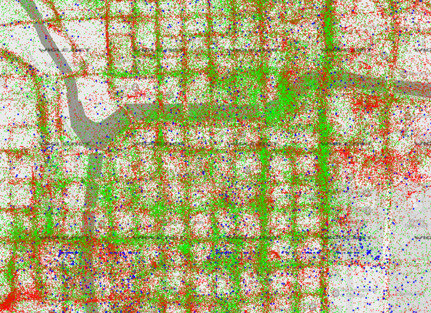

# WiFi Data Safari Workshop

WiFi Data Safari is a digital literacy workshop that aims to educate the public about the wireless network data that constantly surrounds them. Participants are lead through an urban environment spotting and collecting wireless signals from nearby personal devices as they travel. Using custom software, participants access personally identifiable data from strangers and perform targeted network attacks against volunteers, in an attempt to better understand the privacy concerns and exploitation tactics associated with WiFi. Throughout the workshop, we have conversations about information privacy and security, the shortcomings of the WiFi protocol, and the ways that companies, governments, and other malicious actors and use personal wireless data.

The WiFi Data Safari Workshop is a continuation of the [Probe Kit project](http://probekit.brangerbriz.com/).

## The Workshop

For participants of the workshop, this document serves as a reference for the material that we cover during the workshop. For those of you who wandered here from the far reaches of the Internet, welcome. We hope that you will learn something while you are here, even if you couldn't make it to the workshop.

> Screenshot of the data safari software used in the workshop

### The Internet Landscape

The Internet is a complex network of networks, linked together through industrial communications infrastructure. Many players are involved, from router and device manufacturers to Internet Service Provider (ISP), Tier 1 networks , Internet Exchange Points (IXP), trans-oceanic fiber optic cable, and international standards committees. Lots of machines talking to machines and people talking to people. Surprising to some, most of the Internet is connected by fiber optics and copper cable. It's usually only the last stretch from your home router or a cell tower to your portable device that occurs over WiFi, a wireless radio frequency protocol that occupies the 2.4 GHz and 5 GHz frequency bands of electromagnetic spectrum (along side other commercial devices like your microwave and garage door openers). Its this protocol that we will be taking a look at particularly in this workshop. The 802.11 WiFi standard was introduced in 1997, before anyone had a phone that could connect to the Internet. As such, the specification was introduced without the security considerations and requirements that are necessary over twenty years later, when everyone walks around with a wireless device on their person. 

> United States Electromagnetic Frequency Allocations

### Probe Requests and Beacon Frames

Ever wonder how it is that your phone auto-connects to your home WiFi network automatically without you having to explicitly authenticate your device each time? This occurs through a series of network packet exchanges between your wireless device and your home router, or _access point_ (AP). Specifically, it leverages the use of two related 802.11 packet types, _probe requests_ sent from your device and _beacon frames_ sent from your access point. Probe requests are small packets of information that are emitted from a wireless device when it isn't connected to an access point. They include two useful pieces of information, 1) the SSID, or network name, of the access point it has previously connected to and 2) the MAC address of the probing device, a unique identifier that can be used as a device fingerprint. Many devices that have WiFi enabled, but aren't connected to a network, are constantly emitting probe requests hoping that their router will hear them and initialize an auto-connection. That's useful if you happen to have just entered your home from work, but as we will see, it's also identifiable information that's openly projected from your device when you are out and about, nowhere near the router your device is attempting to connect to. In this way, WiFi devices are constantly advertising your personal network history wherever you go, leaving a fingerprint in the WiFi radio ether for others to pick up and use. 

Beacon frames serve a similar purpose to probe requests in that they exist to facilitate the authentication of devices to access points. Beacon frames contain the same useful bits of information as probes, only they are sent from access points that are advertising their existence to nearby devices. As soon as your phone sees a beacon frame emitted from the "My Home WiFi" access point, it will initialize a connection to the router. While this is helpful in the genuine case where your device auto connects to a known network, it also makes it trivial for an attacker to force a connection from your device to a malicious network by simply naming their network the same as your home network. This makes probe requests and beacon frames a lethal combination. One advertises the name of previously connected networks at all times, while the other can be used to auto-connect devices knowing only the names of previously connected networks.

<!-- STILL NEED TO FIND A GOOD PLACE TO SAY THIS
>>[ should also mention that the constant advertising of probe requests makes it possible to track ur movements through a space, assuming of course someone sets up a large enough area of monitors... like the london trash cans]
-->

### Accessing Network Data

Now that you've learned that the network devices around you are regularly broadcasting probe requests, you might be wondering how you would go about accessing that data. Your privy to seeing a list of network names on your phone or laptop when you are looking to connect to a new network, but you likely haven't ever been able to access the other packets of data _hidden_ from normal view. You can't see activity from other peoples devices using that familiar network drop down and you certainty can't get list of other people's home networks. Instead, your operating system filters out this data, exposing only the information necessary for you to connect to a WiFi network. 

Well, it turns out that many consumer WiFi cards support a special behavior called _monitor mode_ that effectively removes this filter. Monitor mode allows your computer to passively eavesdrop on the unencrypted radio packets nearby independent of the intended sender and receiver. Unlike a wired connection, wireless _broad_cast can't be easily directed to a single device. It's exactly what it sounds like, messages are broadly cast to all devices. 

Aircrack-ng is a standard suite of networking tools that allow you to inspect and interface with WiFi data in this unfiltered manner. We've built custom software that sits on top of these tools and exposes the activity of probing devices and beaconing access points. During the workshop, we use this software to visualize wireless activity that is normally hidden from view.

### What's to see?

All WiFi network transmissions include a media access control number, or MAC address, that identifies which device sent the radio packet. MAC addresses are unique numbers assigned to a network interface by the manufacturer. They act as a sort of device fingerprint which can be used to identify the device, and in the case when you can tie a MAC address to the device owner, the presence of nearby human. Information about the manufacturer of the device is also embedded in a portion of the MAC address, making it trivial to identify if it belongs to an Apple iPhone or a Samsung Android phone. Other indicators can also be derived from intercepted packets, like signal strength and timestamps. When monitoring WiFi traffic, it's not unlikely that packets with a strong signal strength are close by. Those _loudly_ broadcast packets you keep receiving from an Apple device might just be coming from to that fellow sitting next to you who is roboticly thumbing through his iPhone. 

Once you've identified which devices belong to which humans you can start to gather more information about their owners. By collecting and grouping probe requests and cross referencing their network names with publicly available datasets you can begin to draw conclusions about where the device owner may live, work, and play. 

### War Driving and Geographic Network Datasets

War driving is the process of geo-tagging beacon frames from wireless access points in an attempt to understand where in the world they are physically located. By collecting data in this fashion, large datasets can be amassed and used to identify where the networks a device is probing for exist. In fact, Google street view cars have been reported to be constantly war driving, creating collection of geo-tagged networks to use in their location services. By using cars, and even their user's android devices as they go about their daily life, they can create complex maps of beaconing networks that can be used later to improve on GPS estimates, or identify where you are located even when you have GPS location turned off.

> [WiGLE.net](https://wigle.net/) War driving data from Chicago, IL. Each point represents a WiFi network. 

The practice of war driving is often associated with amateur network collection. The [WiGLE website](http://wigle.net) is a crowdsourced war driving dataset that is available for public use. For this workshop, we downloaded WiGLE data from the Los Angeles area in order to offer a map view feature to workshop participants. Probe requests that are collected during the data safari can be queried against this dataset to provide information about where the device owner may spend their time.

### Honeypot & Evil Twin Networks

At best, probe request collection can lead to the passive collection of seemingly banal personal information that can result in the 1) identification of human presence and 2) potential reconstruction of past physical location. At worst, they can lead to an active network attack on the probing device. Because networks are often configured to auto-connect to known networks, an attacker can easily create ad-hoc networks with SSIDs that match those a targeted device is probing for. By forcing a connection in this way an attacker can exploit vulnerabilities in software running on the device to record, intercept, or alter the user's Internet activity, or perform a phising attack to steal the user's account credentials.

Internet service providers have been known to exploit this SSID auto-connection feature in the wild. Comcast's XFINITY routers automatically create two networks, one to serve the customer who purchased the router, and the second to serve the rest of their customers. This second network beacons with the SSID "xfinitywifi" to lure probing customers to auto-connect. This prompts a captive portal on the user's device with a form to login to their Comcast account and piggy back of the router owner's Internet connection to surf the net.

### What's to be done?

The picture we paint of the WiFi protocol is fairly bleak. The aging WiFi standard was introduced at a time when the networked landscape was very different than it is now, and yet we continue to expect it to "securely" connect the devices we rely so heavily on today. Though probe requests and beacon frames likely aren't going anywhere soon, there are a few measures that can be taken to protect yourself from data collection and targeted attacks against your devices.

The most effective protection is to turn your device's WiFi off while in-transit or whenever you aren't connected to a familiar network. Doing so will keep your device from constantly sending probe requests and make it inaccessible to attackers. 

Another privacy mechanism that is starting to be more regularly adopted by device manufacturers and operating system developers is MAC randomization. This approach broadcasts probe requests with a random MAC address, making it difficult to detect the presence of an identifiable MAC fingerprint or to tie multiple probed SSIDs to the same device. More devices are using this method today than we found them to be two years ago, but this approach still isn't without its shortcomings. Devices that use MAC randomization for probe requests still authenticate to access points using their true MAC address, making the use of honeypot access points an effective method to identify the true MAC addresses.

<!-- ## References

If you enjoyed these workshop materials and you are interested in learning more about interesting projects that other artists and researchers have been conducting in the WiFi space, here are a few references:

- Probe Kit
- Surya and Kyle's probe kit project
- Julian Oliver's Beacon Frame geo-location spoofing project
- Newstweek
- Aircrack-ng suit
- The Perils of Probe Requests
- Why MAC randomization isn't enough
 -->
<!-- This is the most sure fire way to protect yourself from this sort of abuse, but if remembering to disable your WiFi becomes burdensome,  -->

<!--Once connected -->

<!--
## References

## Running the Software Yourself

x Explain Internet landscape, wires vs wireless
x Maybe also a little infrastructure spotting here ( cell towers, manholes, etc. )
x Explain probes && beacons
	- Discuss basic info in the app 
x What’s a MAC address ( how that relates to vendor )
x How you might use timestamps ( is this someone around you? )
x What can you do with a collection of probes ( bssid’s )
x How it’s used to track in a location
x Explain Wigle/wardriving, discuss map
x Malicious honeypot (evil twin networks)
x Discuss protections 
x If haven’t already discuss MAC randomization (+short comings)
x Discuss turning WiFi off ( settings now in iOS )
- Discuss other possibilities ( Android app, +related geo approach )

Branger_Briz will lead participants on a tour through the city visualizing all the invisible Wifi data floating all around us via a custom built network application. Participants will access the custom app on their smart-phones and use it to scan and analyze the data in different parts of the city. Branger_Briz will lead participants through a series of discussions and Wifi hacking demonstrations as well as explanations on basic privacy measures and practices that can be taken to limit your wireless footprint in the wild. The data collected during the safari will be brought back to the gallery at the end of the workshop and added to the ProbeKit installation.

Probe Kit is an ongoing critical software art project that aims to educate the public about the
wireless network data that constantly surrounds them. Probe Kit captures 802.11 WiFi probe request
packets from passersby devices that are silently exposing personal information about the owner’s
previously connected WiFi networks and the physical locations where they may work, live, and play.
Through a metaphor of bug collection, we present the data collected as a wireless habitat, where
nearby WiFi devices appear as unique butterflies with “migration patterns” derived from publicly
accessible war driving data. By collecting and algorithmically organizing probe request data and then
cross referencing it with other datasets, we create a profile of each device in the area which
includes all the WiFi networks that device has ever connected to along with an interactive map
charting where these networks exist in physical space.
One of the most valuable currencies of our era is personal data, despite this fact, many of us don’t
really understand what it is, how it’s collected or exchanged and how it’s turned into wealth. Data
security is a low priority for much of the popular software and hardware we use today. As a result, it
isn’t difficult for institutions with the right tools to collect and leverage much of your personal
information.
In addition to the Probe Kit installation, we also lead a Wireless Data Safari workshop where
participants learn about wireless networks and collect network data themselves. The workshop
takes a small group on an outdoor walking tour. They are equipped with custom software that acts
as a navigation aid in exploring the wireless world around them. Throughout the safari, we discuss
how the WiFi protocol works and the hidden implications that come with a technology we all use

every day. At the end of the workshop, we gather together to review and analyze the data we have
captured and talk about steps that can be taken to hide or mask our wireless footprints.

-->